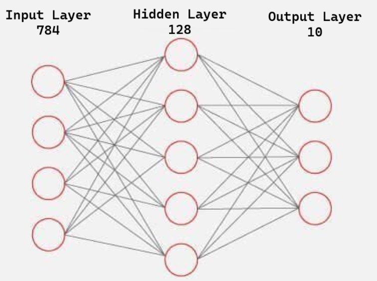
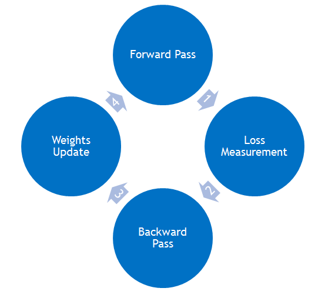

# Digit Recognition

> The *hello world* of machine learning

This project focuses on creating a basic neural network to recognize handwritten digits using the [MNIST database](http://yann.lecun.com/exdb/mnist/).  
The main objective was to demystify the complexity of neural networks and gain a foundational understanding of how they work.  

Instead of using pre-built machine learning libraries, this project was developed from scratch, solving challenges step by step. This approach provided a solid grasp of the core concepts behind neural networks.

## Architecture

> Input layer: **784 neurons**  
> Hidden layer: **128 neurons**  
> Output layer: **10 neurons**

### Input Layer
The MNIST database consists of 60,000 training images and 10,000 test images, each 28x28 pixels in size.  
To feed these images into the neural network, the input layer contains one neuron for each pixel (28 × 28 = 784).  

Pixel values are normalized:  
- **1** for painted pixels.  
- **0** for unpainted pixels.  

### Hidden Layer
The hidden layer contains **128 neurons**, chosen as a balance between performance and computational efficiency.  
This number is sufficient to capture patterns in the MNIST dataset without overfitting or excessively slowing down the training process.

### Output Layer
The output layer contains **10 neurons**, one for each digit (0–9). Each neuron outputs a value representing the confidence that the input corresponds to the respective digit.

## Training Cycle

The training process of a neural network follows a basic cycle composed of four key stages:

1. **Forward Pass**  
    During this stage, the input data (e.g., an MNIST image) is passed through the network.  
    Each layer computes its output by applying a linear transformation (weights and biases) followed by an activation function. This produces predictions at the output layer.  
    > $Aj$ = $relu$($\displaystyle\sum_{i=1}^{N}Wij$ * $Ai$ + $Bj$)
    
    The value of the  neuron $j$ ($Aj$) is determined by the expression above. Where $Wij$ is the weight connecting the neuron $j$ and the neuron $i$, $Ai$ is the value of the neuron $i$, $Bj$ the bias of the neuron $j$.

2. **Loss Measurement**  
   The loss function is used to measure the difference between the network's predictions and the actual labels.  
   Common loss functions, such as cross-entropy loss, quantify how well or poorly the network performs, providing a numerical value for the error.

3. **Backward Pass (Backpropagation)**  
   In this stage, the error is propagated backward through the network to calculate the gradients of the loss with respect to each weight and bias.  
   Using the chain rule, each layer computes how much it contributed to the total error, enabling precise adjustments.

4. **Update Weights and Biases**  
   The weights and biases are updated using the gradients computed during backpropagation.  
   An optimization algorithm, such as Gradient Descent, adjusts the parameters in small steps (defined by the learning rate) to minimize the error.  

This cycle is repeated over multiple iterations (*epochs*) across the dataset until the network achieves satisfactory performance.
